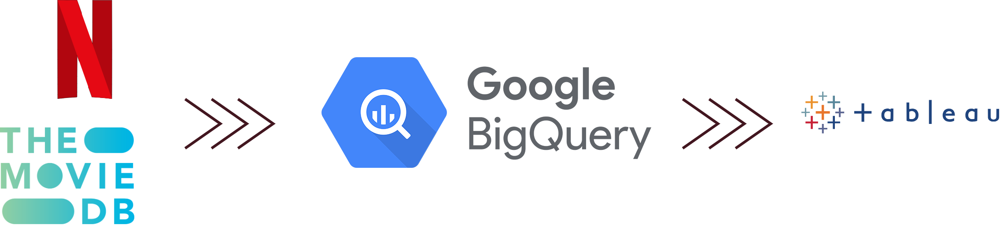
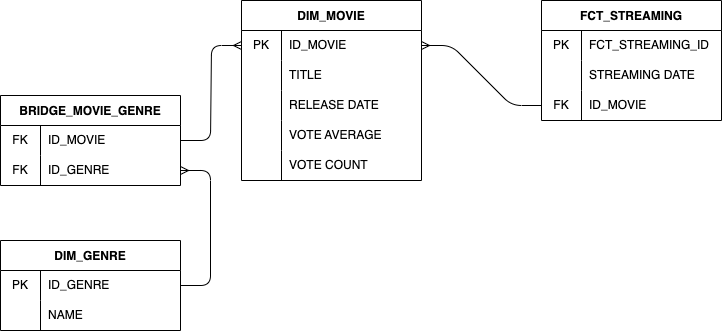
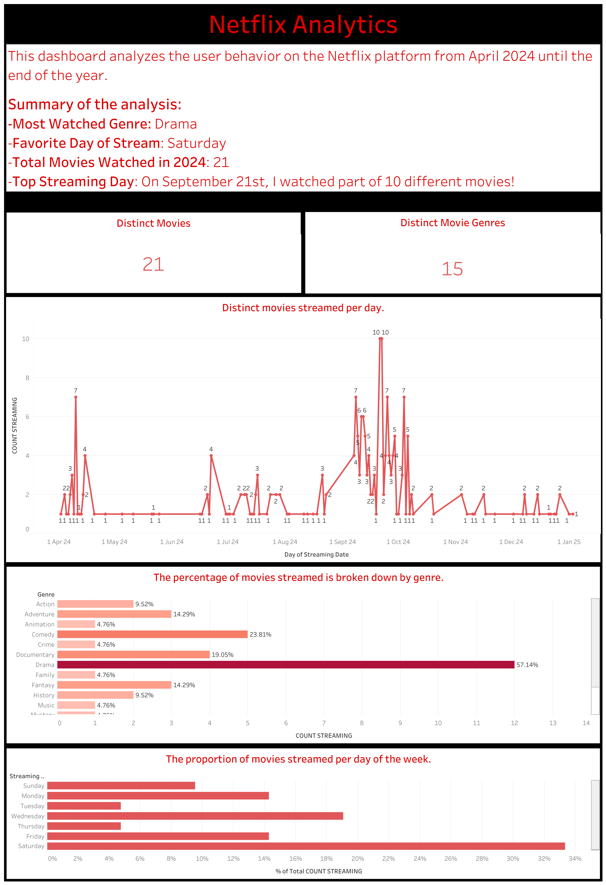

# netflix-analytics
Analyze personal Netflix usage

- [Goal](#goal)
    - [Business Questions](#business-questions)
- [Technical Guide](#technical-guide)
    - [Data Flow](#data-flow)
        - [Data Source](#data-source)
        - [Data Storage](#data-storage)
        - [Visualization](#visualization)


## Goal
This project aims to analyze Netflix usage from the first day of subscription (April 2024) until the end of the year.

### Business Questions
- what are the most watched movie category?
- how often did I watch movies per week?
- what is the most engaged movie genre?

## Technical Guide
In order to reach the goal these are the steps to follow to develop the system:
1. ingest data from Netflix
2. for each movie, extract the details (via the [TMDB](https://www.themoviedb.org/) API)
3. create the star schema


### Data Flow



#### Data Sources
- Netflix data: the dataset extracted at the end of 2024 is related to the movies streamed on the platform (title, date of stream)
- TMDB API: extract movie details (release date, genre, ...)

#### Data Storage
- Google Cloud Storage: store the RAW data (data lake)
- Google BigQuery: load raw data and transform (star schema)

```
- DIM_MOVIE: ID_MOVIE (PK)
- DIM_GENRE: ID_GENRE (PK)
- FCT_STREAMING: FCT_STREAMING_ID (PK)
- BRIDGE_MOVIE_GENRE: ID_MOVIE (FK), ID_GENRE (FK)
```



#### Visualization
The outcome of the star schema is a layer that is read from [this](https://public.tableau.com/app/profile/fabi5755/viz/NetflixAnalytics_17372167014910/Dashboard1#1) dashboard on Tableau.
